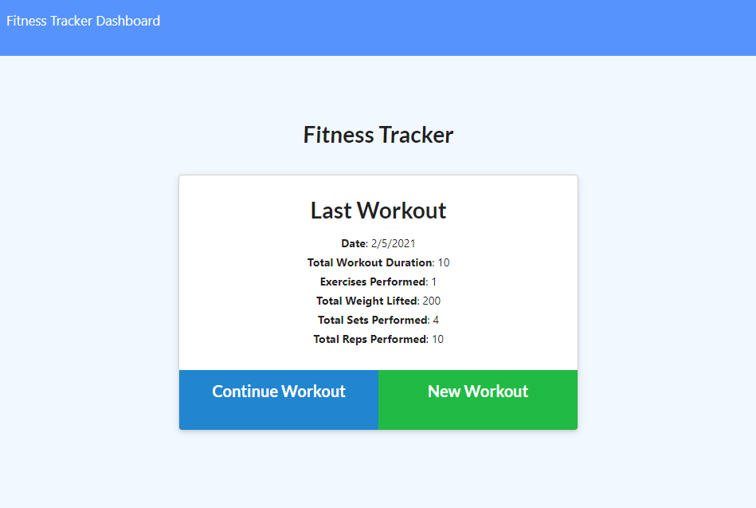
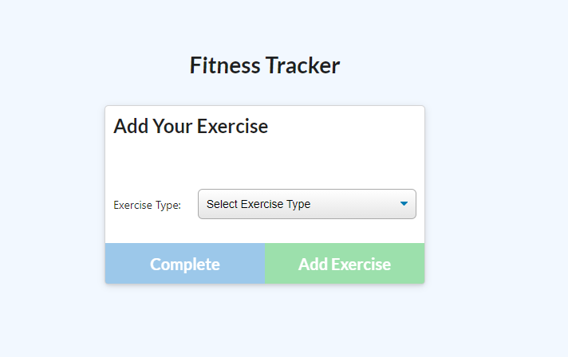
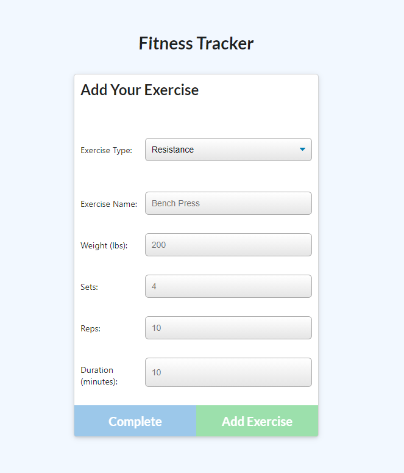
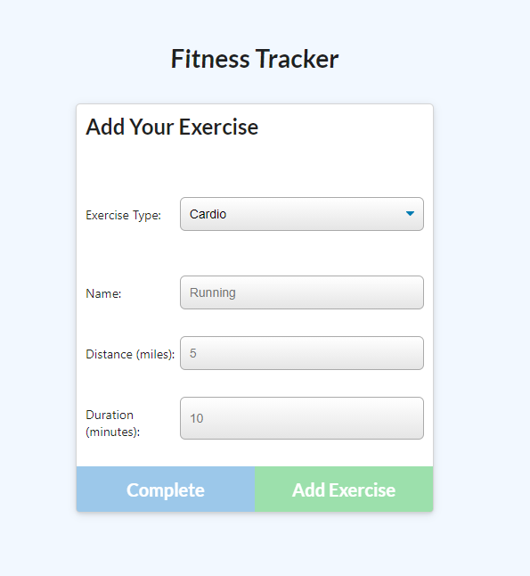
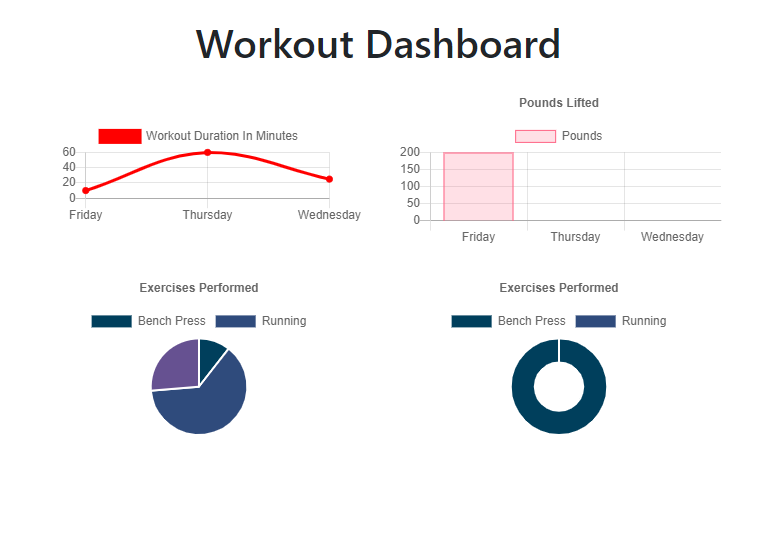

# Fitness Tracker 🤽‍♀️

***

  
  
  
  

## Table of Contents
* [Description](#description)
* [Usage](#usage)
* [Questions](#questions)
* [License](#license)

 

## Description
Fitness Tracker is an app for a user to create and track their workouts daily.  A new workout may be created for the day, and multiple exercises may be added to the workout.  If a workout was already created for the day, the user may continue the workout to add more exercises.  The Dashboard will show the stats of the past 7 workouts for the user.

Feel free to check out the website [here](https://christina2021-fitness-tracker.herokuapp.com/)
 

## Usage
Please see the following instructions on how to use this application:  
⭐ Once the webpage has been open, create a new workout for the day by clicking on the green "New Workout" button.  If a workout for the day has already been created, click on the blue "Continue Workout" button to add more exercises for the day's workout. 

⭐ A page will then appear to add in a new exercise.  If the type of exercise is "Resistance", then fields for exercise name, weight (in pounds), sets, reps, and duration (in minutes) will need to be completed.  If the typd of exercise is "Cardio", then fields for the exercise name, distance (in miles), and duration (in minutes will need to be completed). 

⭐ The dashboard page will show the stats for the past 7 workouts.  It will include the daily workout duration, pounds lifted, and exercises performed. 

## Questions?
Feel free to check out my github profile [here](https://github.com/Christina2021)!
Should you have any questions, you may reach me by e-mail at: <a href="mailto:codechristina2021@gmail.com">codechristina2021@gmail.com</a>!

## License
[MIT](https://choosealicense.com/licenses/mit/#)